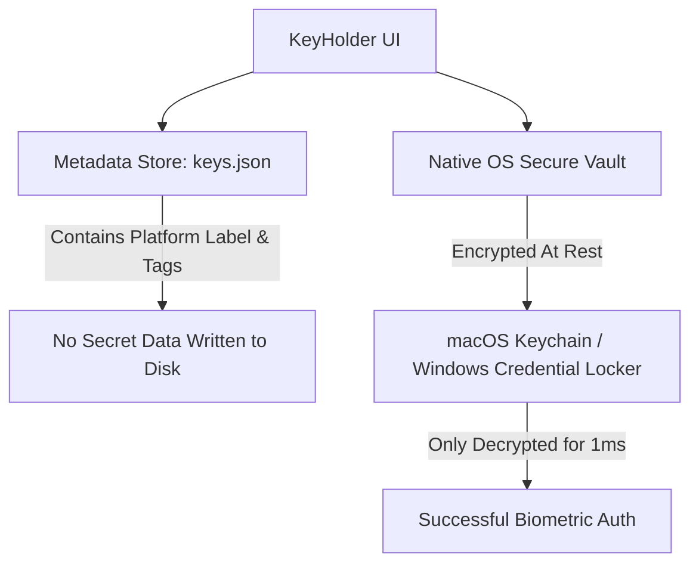

# KeyHolder 🔑

[](https://apple.com)
[](https://microsoft.com)
[](https://swift.org)
[](https://dotnet.microsoft.com)
[](https://dotnet.microsoft.com)

**KeyHolder** is a native, ultra-lightweight, and highly secure status bar (menu bar / system tray) utility built for developers. It lives silently beside your system clock, allowing you to instantly search, copy, and manage API keys, access tokens, and sensitive credentials for all your development platforms. 

Built in pure **SwiftUI** for macOS and **C# / WPF** for Windows, KeyHolder is designed to be completely native, exceptionally fast, and secure by design.

---

## 🚀 Key Features

*   **Zero-Clutter Desktop Accessory**: Lives entirely in your macOS menu bar or Windows system tray. Click the key icon to slide open a clean, native popover directly underneath.
*   **Hardware-Backed Encryption**: Secret keys are stored securely using OS-level native secure vaults. They are encrypted at rest by the operating system and tied to your user account.
*   **Biometric Access (Touch ID & Windows Hello)**: Copying or revealing credentials requires fingerprint, face recognition, Apple Watch, or PIN authentication.
*   **Smart Session Auto-Lock**: The popup window automatically auto-locks itself and hides the moment it loses focus (clicks away), ensuring credentials are never left exposed.
*   **Smart Platform Auto-Mapping**: Automatically parses platform names (case-insensitive) and maps them to custom colored icons.
*   **Real-time Search & Filter Tags**: Instantly search platforms, reference labels, or use color-coded tag pills (`dev`, `prod`, `api`) to filter your keys.

---

## 📦 Native Platform Implementations

| Feature | macOS Version | Windows Version |
| :--- | :--- | :--- |
| **Language & UI** | Swift 6.0 / SwiftUI | C# 12 / WPF |
| **Accessory Style** | Menu Bar Accessory (`LSUIElement = 1`) | System Tray Utility (`NotifyIcon` + Background App) |
| **Secure Vault** | Keychain Services (`Security` API) | Credential Locker (`PasswordVault` API) |
| **Biometrics** | Touch ID / Apple Watch (`LocalAuthentication`) | Windows Hello (Fingerprint / Face / PIN) |
| **App Size** | **~680 KB** | Ultra-lightweight self-contained `.exe` |

---

## 🔒 Security Architecture

KeyHolder enforces a strict **separation of concerns** in its storage model:



1.  **Metadata Store (`keys.json`)**:
    *   **macOS Path**: `~/Library/Application Support/com.olixstudios.KeyHolder/keys.json`
    *   **Windows Path**: `%APPDATA%/KeyHolder/keys.json`
    *   *Stores*: Platform names, account/reference labels, tags, and a unique `id` (UUID).
    *   > [!IMPORTANT]
        > **No secret keys, passwords, or token values are ever written to disk as clear text.**
2.  **Secure Vault Store**:
    *   *Stores*: The raw credential secrets.
    *   Secrets are saved into your macOS System Keychain or Windows Credential Locker. The secret key is only queried from the secure OS vault at the exact millisecond you choose to copy or reveal it, and **only after successful biometric authentication**.

---

## 🎨 Platform Auto-Mapping

KeyHolder parses platform names on-the-fly to assign them a specific icon category and primary accent theme:

| Platform Category | Matches (Substring) | Icon / Symbol | Accent Theme |
| :--- | :--- | :--- | :--- |
| **AI & Machine Learning** | `openai`, `chatgpt`, `claude`, `anthropic`, `gemini`, `huggingface`, `cohere`, `deepseek`, `ollama` | Sparkles (✨) | Teal / Orange / Purple / Yellow / Blue |
| **Version Control** | `github`, `gitlab`, `bitbucket`, `git` | Terminal (💻) | Purple / Orange / Blue |
| **Cloud & Hosting** | `aws`, `amazon`, `azure`, `cloudflare`, `digitalocean`, `heroku`, `vercel`, `netlify`, `fly.io`, `render` | Cloud (☁️) | Orange / Blue / Purple / Black / Cyan |
| **Databases & Backend** | `postgres`, `mysql`, `mongo`, `redis`, `supabase`, `firebase`, `dynamodb`, `prisma`, `hasura`, `db` | Database Server (🗄️) | Green / Mint / Orange / Blue / Red |
| **Payments & Commerce** | `stripe`, `paypal`, `braintree`, `adyen`, `coinbase`, `shopify` | Credit Card (💳) | Indigo / Blue / Lime |
| **Networking & Servers** | `ssh`, `server`, `vps`, `docker`, `kubernetes` (k8s), `nginx` | Network (🌐) | Gray / Blue |
| **Productivity & Chat** | `slack`, `discord`, `telegram`, `teams`, `zoom`, `notion`, `figma`, `jira`, `linear` | Speech Bubble (💬) | Pink / Blue / Indigo / Purple |
| **Monitoring & Logging** | `sentry`, `datadog`, `grafana`, `prometheus`, `mixpanel`, `amplitude` | Waveform (📈) | Purple / Orange |
| **Communications & Email** | `twilio`, `sendgrid`, `mailchimp`, `postmark`, `ses` | Paper Plane (✈️) | Red / Blue |
| **Search & General APIs** | `google` | Globe (🌍) | Blue |

---

## 🛠️ Build & Installation

### macOS (Swift)

> [!TIP]
> Ensure you have Xcode Command Line Tools installed (`xcode-select --install`).

To compile the Swift project in release mode, build the `.app` bundle, configure `Info.plist`, and launch the app into your menu bar:
```bash
./build.sh
```

---

### Windows (C# / .NET 8)

> [!TIP]
> Ensure you have the [.NET 8.0 SDK](https://dotnet.microsoft.com/en-us/download/dotnet/8.0) installed on your Windows environment.

##### Run in Development
```cmd
cd windows/KeyHolder
dotnet run
```

##### Build a Standalone Executable
You can compile KeyHolder as a **self-contained single-file `.exe`** containing all native assemblies and runtimes. This will run on any Windows 10/11 PC with **zero external prerequisites**:
```cmd
cd windows/KeyHolder
dotnet publish -c Release
```
This outputs a single executable file at:
`windows/KeyHolder/bin/Release/net8.0-windows10.0.19041.0/win-x64/publish/KeyHolder.exe`

---

## 📂 Project Directory Structure

```text
keyholder/
├── Package.swift            # macOS Swift Package Manager configuration
├── build.sh                 # macOS Compilation and App Bundle packaging script
├── README.md                # Documentation
├── Sources/                 # macOS SwiftUI Source Code
│   └── keyholder/
│       ├── KeyHolderApp.swift   # Main SwiftUI App entry point (accessory activation policy)
│       ├── Models/
│       │   ├── KeyItem.swift        # Metadata schema and icon mapping logic
│       │   ├── KeychainHelper.swift # Wrapper around macOS SecItem Keychain APIs
│       │   ├── SecurityManager.swift# LocalAuthentication (Touch ID) coordinator
│       │   └── StorageManager.swift # File loader/saver for keys.json
│       └── Views/
│           ├── MainView.swift       # Primary UI (search, filter pills, inline transitions)
│           ├── KeyRowView.swift     # Individual rows with hover triggers and copy animations
│           ├── AddKeyView.swift     # Inline form inputs with secure layout overrides
├── Tests/                   # macOS Unit Tests
└── windows/                 # Windows C# / WPF Source Code
    ├── KeyHolder.sln           # Visual Studio Solution
    └── KeyHolder/
        ├── KeyHolder.csproj    # WPF project targeting .NET 8.0 & WinRT (Windows SDK 19041)
        ├── App.xaml            # Application entry point
        ├── App.xaml.cs         # System tray NotifyIcon manager & popup window positioning
        ├── Models/
        │   ├── KeyItem.cs       # Metadata model with platform Segoe glyph & brush mappings
        │   ├── CredentialHelper.cs # Interface wrapping Windows Hello Credential Locker
        │   ├── SecurityManager.cs  # Biometrics Authenticator wrapping Windows Hello WinRT APIs
        │   └── StorageManager.cs   # JSON loader/saver matching macOS keys.json structure
        └── Views/
            ├── MainWindow.xaml  # Premium dark mode WPF popover layout
            └── MainWindow.xaml.cs # Code-behind for search, filtering, copying & form input
```

---

## 📄 License
This project is licensed under the MIT License - see the LICENSE file for details.
