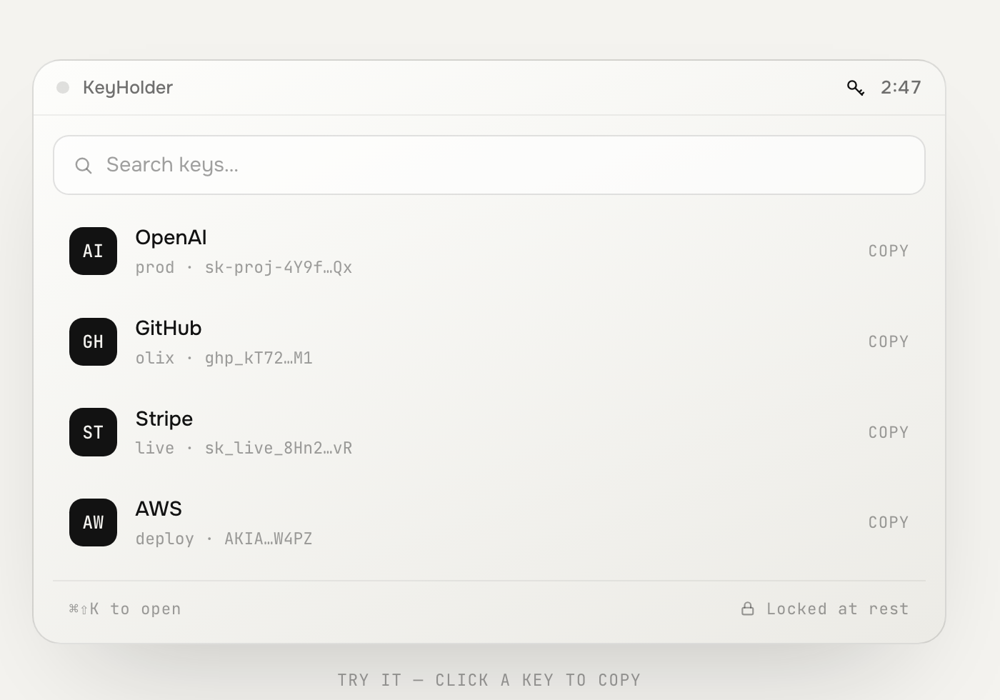
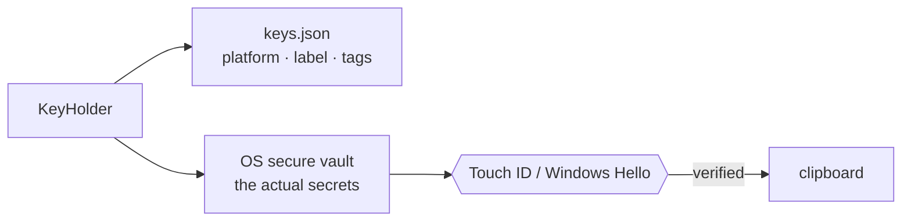

<div align="center">

# KeyHolder

**Your keys, one keystroke away.**

A native menu bar / system tray vault for API keys.<br>
Hardware-backed storage. Biometric unlock. Zero Electron.

[**Website**](https://olixignacious.github.io/keyholder/) · [**Download**](https://github.com/OlixIgnacious/keyholder/releases/latest) · [**Build from source**](#build-from-source)

[](https://github.com/OlixIgnacious/keyholder/releases/latest)
[](https://github.com/OlixIgnacious/keyholder/releases/latest)
[](https://github.com/OlixIgnacious/keyholder/releases/latest)
[](#license)

<br>



</div>

---

## Why

API keys end up in dotfiles, Slack DMs, and `notes.txt`. KeyHolder gives them a
proper home: a tiny native popover next to your clock. Open it, type two
letters, hit copy — Touch ID or Windows Hello verifies it's you, the secret
lands on your clipboard, and everything locks itself again.

- **Out of sight, never out of reach** — no dock icon, no window. A key icon in the menu bar / system tray, summoned with a click.
- **Hardware-backed, nothing in cleartext** — secrets live in macOS Keychain / Windows Credential Locker, never on disk.
- **Biometric gate** — every copy and reveal requires Touch ID, Apple Watch, or Windows Hello.
- **Auto-lock** — click away and the popover vanishes and locks. Nothing lingers.
- **Featherweight** — pure SwiftUI and WPF. The macOS app is **~700 KB**.
- **Strictly local** — no servers, no sync, no analytics, no network calls. Ever.

## How secrets are stored

Metadata and secrets never travel together:



| | macOS | Windows |
|---|---|---|
| **Metadata** | `~/Library/Application Support/com.olixstudios.KeyHolder/keys.json` | `%APPDATA%/KeyHolder/keys.json` |
| **Secrets** | Keychain Services (`Security` API) | Credential Locker (`PasswordVault` API) |
| **Unlock** | Touch ID / Apple Watch (`LocalAuthentication`) | Windows Hello — face, finger, PIN |

`keys.json` holds platform names, labels, and tags only. The secret is fetched
from the OS vault at the millisecond you copy it — and only after biometric
authentication succeeds.

## Install

Grab the [latest release](https://github.com/OlixIgnacious/keyholder/releases/latest):

| Platform | Asset | Notes |
|---|---|---|
| macOS (Apple Silicon) | `KeyHolder-macOS-*.zip` | Unzip → move to /Applications. Unsigned for now: right-click → **Open** on first launch. |
| Windows 10/11 (x64) | `KeyHolder-windows-x64-*.zip` | Self-contained single `.exe` — no .NET install needed. SmartScreen: **More info → Run anyway**. |

### Shortcuts (macOS)

| Keys | Action |
|---|---|
| `⌘N` | Add a new key |
| `Esc` | Dismiss the add/edit form |
| just type | Search is focused by default |

## Build from source

**macOS** — needs Xcode Command Line Tools (`xcode-select --install`):

```bash
./build.sh   # release build → app bundle → launches in your menu bar
```

**Windows** — needs the [.NET 8 SDK](https://dotnet.microsoft.com/en-us/download/dotnet/8.0):

```cmd
cd windows/KeyHolder
dotnet run               # development
dotnet publish -c Release   # self-contained single-file exe
```

Tagged releases (`v*`) automatically build the Windows exe on CI and attach it
to the GitHub release.

## Project layout

```text
keyholder/
├── Sources/keyholder/        macOS app — Swift 6, SwiftUI
│   ├── KeyHolderApp.swift      MenuBarExtra entry point
│   ├── Models/                 Keychain, biometrics, JSON store
│   └── Views/                  popover UI, monochrome theme
├── windows/KeyHolder/        Windows app — C# 12, WPF, .NET 8
│   ├── App.xaml.cs             tray icon + popup positioning
│   ├── Models/                 Credential Locker, Windows Hello, JSON store
│   └── Views/                  popover UI
├── website/                  landing page (GitHub Pages)
└── build.sh                  macOS build + bundle script
```

## License

MIT © Olix Studios

<div align="center">
<sub>Built for developers who copy API keys forty times a day.</sub>
</div>
