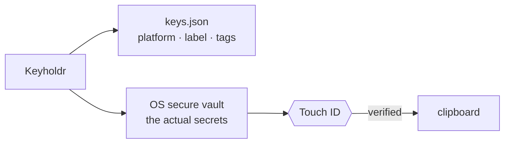

<div align="center">

# Keyholdr

**Your keys, one keystroke away.**

A native menu bar vault for API keys.<br>
Hardware-backed storage. Biometric unlock. Zero Electron.

[**Website**](https://olixignacious.github.io/keyholdr-site/) · [**Download**](https://github.com/OlixIgnacious/keyholdr/releases/latest) · [**Build from source**](#build-from-source)

[](https://github.com/OlixIgnacious/keyholdr/releases/latest)
[](https://github.com/OlixIgnacious/keyholdr/releases/latest)
<!-- Windows is hidden until testing on real hardware completes:
[](https://github.com/OlixIgnacious/keyholdr-windows)
-->
[](#license)

<br>


</div>

---

## Contents

- [Features](#features)
- [How secrets are stored](#how-secrets-are-stored)
- [Install](#install)
- [Terminal companion](#terminal-companion)
- [Build from source](#build-from-source)
- [Project layout](#project-layout)
- [Contributing](#contributing)
- [License](#license)

## Features

API keys end up in dotfiles, Slack DMs, and `notes.txt`. Keyholdr gives them a
proper home: a tiny native popover next to your clock. Open it, type two
letters, hit copy — Touch ID verifies it's you, the secret lands on your
clipboard, and everything locks itself again.

- **Out of sight, never out of reach** — no dock icon, no window. A key icon in the menu bar, summoned with a click or `⌃⌥⌘K` from anywhere.
- **Survives reboots** — starts at login, with a one-click toggle to opt out.
- **Hardware-backed, nothing in cleartext** — secrets live in the macOS Keychain, never on disk.
- **Biometric gate** — every copy and reveal requires Touch ID or Apple Watch.
- **Auto-lock** — click away and the popover vanishes and locks. Nothing lingers.
- **Featherweight** — pure SwiftUI. **~700 KB**.
- **Strictly local** — no servers, no sync, no analytics, no network calls. Ever.
- **Moves when you do** — export the vault to a single passphrase-encrypted file (PBKDF2 + AES-GCM) and import it on the new machine.
- **Terminal native** — `keyholdr get openai` prints a secret after Touch ID; `keyholdr run` injects keys as env vars so they never touch your dotfiles.
- **Rotation nudges** — a quiet `11MO · ROTATE?` hint appears on keys whose secret hasn't changed in six months.

## How secrets are stored

Metadata and secrets never travel together:



| | |
|---|---|
| **Metadata** | `~/Library/Application Support/com.olixstudios.Keyholdr/keys.json` |
| **Secrets** | Keychain Services (`Security` API) |
| **Unlock** | Touch ID / Apple Watch (`LocalAuthentication`) |

`keys.json` holds platform names, labels, and tags only. The secret is fetched
from the OS vault at the millisecond you copy it — and only after biometric
authentication succeeds.

**Self-healing on macOS:** every save also mirrors the (non-secret) metadata
into a Keychain item. If `keys.json` is ever deleted or corrupted, the app
silently restores it from the mirror — and since secrets already live in the
Keychain, deleting the app or its files loses nothing. *(Windows parity is on
the roadmap.)*

## Install

**Homebrew** — the easy way:

```bash
brew install --cask olixignacious/tap/keyholdr
```

Or grab the [latest release](https://github.com/OlixIgnacious/keyholdr/releases/latest) directly:

| Platform | Asset | Notes |
|---|---|---|
| macOS (Apple Silicon) | `Keyholdr-macOS-*.zip` | Unzip → move to /Applications. |

> **Unsigned for now** — macOS blocks the first launch either way. On macOS 15
> (Sequoia) and later: open the app once, then go to **System Settings →
> Privacy & Security → "Open Anyway"**. On macOS 13–14: right-click the app →
> **Open**. Notarized builds are on the roadmap.

<!-- Windows is hidden until testing on real hardware completes:
| Windows 10/11 (x64) | `Keyholdr-windows-x64-*.zip` | **Still in testing** — built on CI but not yet verified on real hardware. Self-contained single `.exe`, no .NET install needed. SmartScreen: **More info → Run anyway**. |
-->

> A native Windows build (C# 12, WPF) lives in
> [keyholdr-windows](https://github.com/OlixIgnacious/keyholdr-windows) — it
> ships once testing on real hardware wraps up.

### Shortcuts (macOS)

| Keys | Action |
|---|---|
| `⌃⌥⌘K` | Summon or dismiss Keyholdr — works system-wide |
| `⌘N` | Add a new key |
| `Esc` | Dismiss the add/edit form |
| just type | Search is focused by default |

## Terminal companion

The app bundles a CLI. Homebrew links it onto your PATH automatically; for
direct downloads, link it once:

```bash
ln -s /Applications/Keyholdr.app/Contents/MacOS/keyholdr-cli /usr/local/bin/keyholdr
```

```bash
keyholdr                                         # interactive: type to filter, ↑↓, ⏎ copies
keyholdr list                                    # every key, with age — never the secrets
keyholdr get openai                              # Touch ID → secret on stdout
keyholdr get github --label work --copy          # to the clipboard instead
keyholdr run -e OPENAI_API_KEY=openai -- npm start   # inject as env vars, nothing on stdout
keyholdr run -- npm start                        # multi-select, conventional names guessed
eval "$(keyholdr env)"                           # multi-select, export lines for your shell
eval "$(keyholdr env openai github/work)"        # or name the keys directly
keyholdr env --names                             # dry run: names only, no Touch ID
keyholdr add github --label work --tags dev,ci   # secret via hidden prompt — never argv
pbpaste | keyholdr add openai                    # or piped straight from the clipboard
keyholdr rm github --label work                  # confirms first; --force for scripts
keyholdr rm                                      # multi-select: ⇥/space to mark, ⏎ deletes
```

When several keys match (`keyholdr get aws` with a work and a personal key),
the same picker opens to choose — in scripts and pipes it stays a hard error
with `--label` hints instead, so automation never blocks. The app refuses to
create two keys with an identical platform + label, so every key stays
addressable.

See [docs/CLI.md](docs/CLI.md) for the full command reference, including
`env`/`run` multi-select and env var naming conventions.

Two one-time prompts while builds are unsigned: Gatekeeper blocks the
quarantined CLI (clear it with
`xattr -dr com.apple.quarantine /Applications/Keyholdr.app`), and the first
read of each key shows a macOS Keychain consent — choose **Always Allow**.
Both disappear once Keyholdr ships signed builds.

## Build from source

**macOS** — needs Xcode Command Line Tools (`xcode-select --install`):

```bash
./build.sh   # release build → app bundle → launches in your menu bar
```

**Windows** lives in its own repo,
[keyholdr-windows](https://github.com/OlixIgnacious/keyholdr-windows)
*(source only while testing is pending)* — needs the
[.NET 8 SDK](https://dotnet.microsoft.com/en-us/download/dotnet/8.0):

```cmd
cd Keyholdr
dotnet run               # development
dotnet publish -c Release   # self-contained single-file exe
```

Tagged releases (`v*`) automatically build the macOS app on CI and attach it
to the GitHub release. The Windows build is manual-dispatch only until it is
verified on real hardware.

## Project layout

```text
keyholdr/
├── Sources/KeyholdrKit/     shared core — model, Keychain, storage, vault export
├── Sources/keyholdr/        macOS app — Swift 6, SwiftUI
│   ├── KeyholdrApp.swift      MenuBarExtra entry point
│   ├── Models/                 login item, global hotkey
│   └── Views/                  popover UI, monochrome theme
├── Sources/keyholdr-cli/    terminal companion — list, get, run
├── website/                  landing page (GitHub Pages)
└── build.sh                  macOS build + bundle script
```

The Windows app (C# 12, WPF, .NET 8) lives in its own repo:
[keyholdr-windows](https://github.com/OlixIgnacious/keyholdr-windows).

## Contributing

Issues and pull requests are welcome — bug reports, platform/icon mappings,
and CLI ergonomics are especially useful. By opening a PR you agree your
contribution is provided under the same non-commercial license as the rest
of the project.

## License

Non-commercial use only. Free to copy, fork, and modify for personal or
educational use — not for resale or commercial services. All copyright
remains with Ashwini Sharma (Olix Studios). See [LICENSE](LICENSE).

<div align="center">
<sub>Built for developers who copy API keys forty times a day.</sub>
</div>
