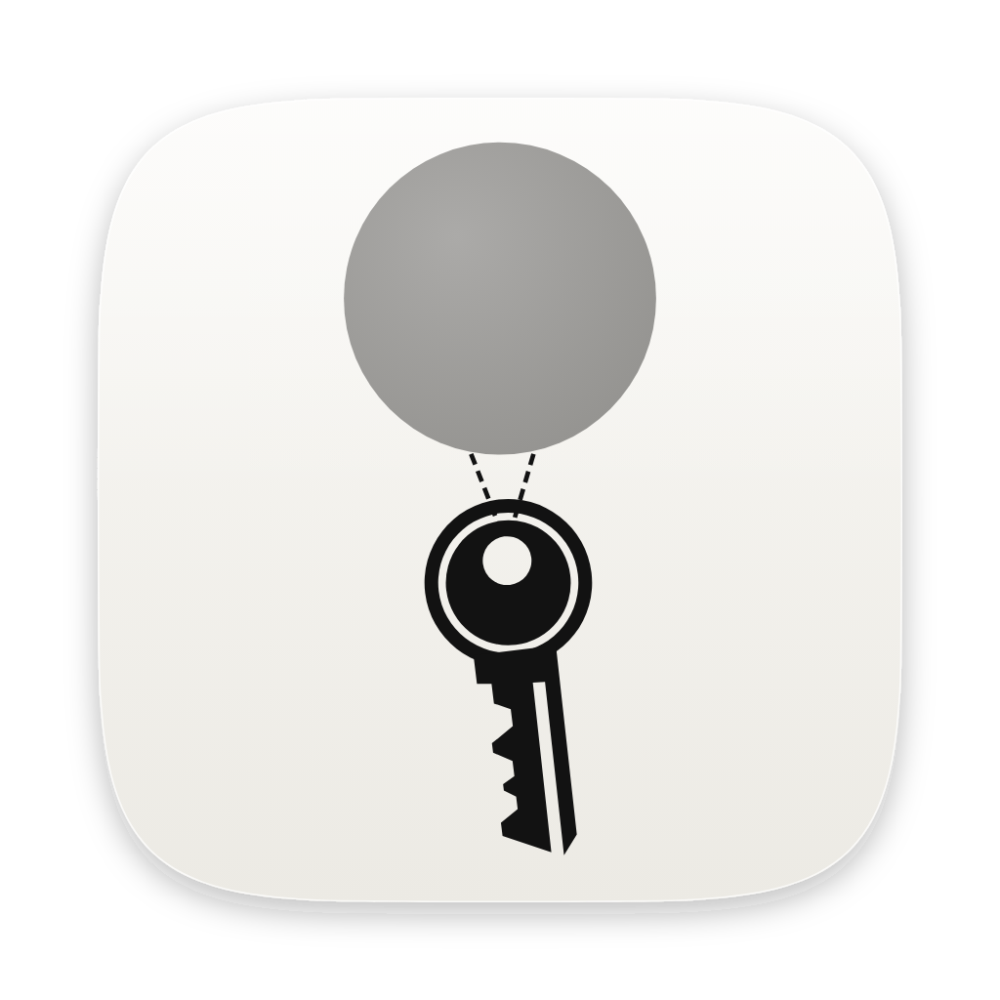
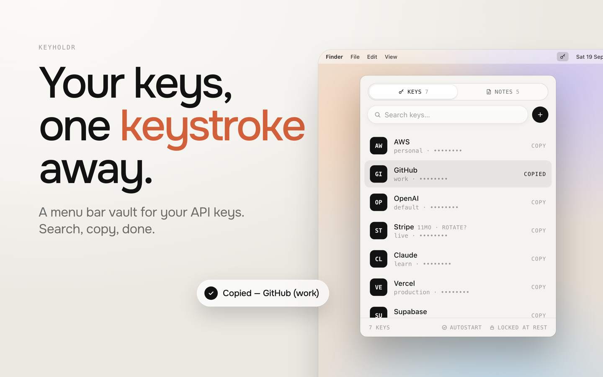
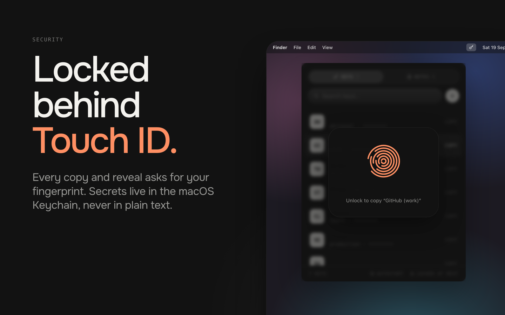
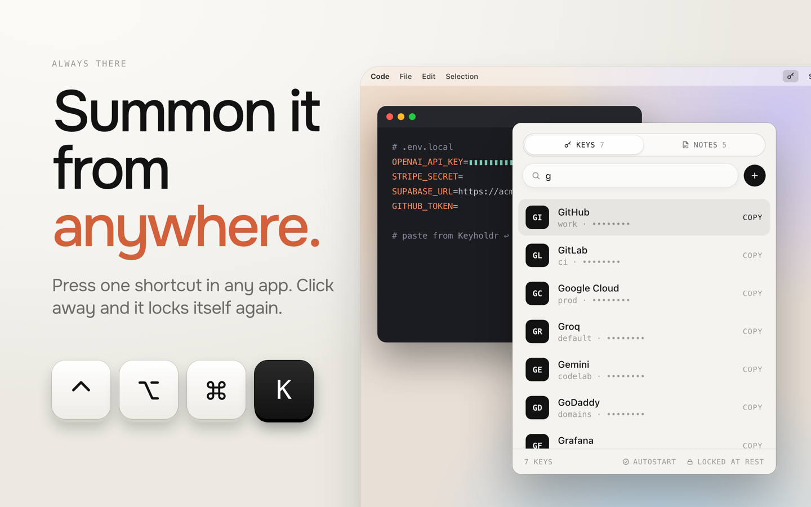
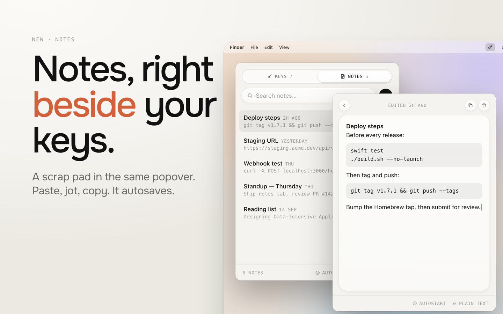
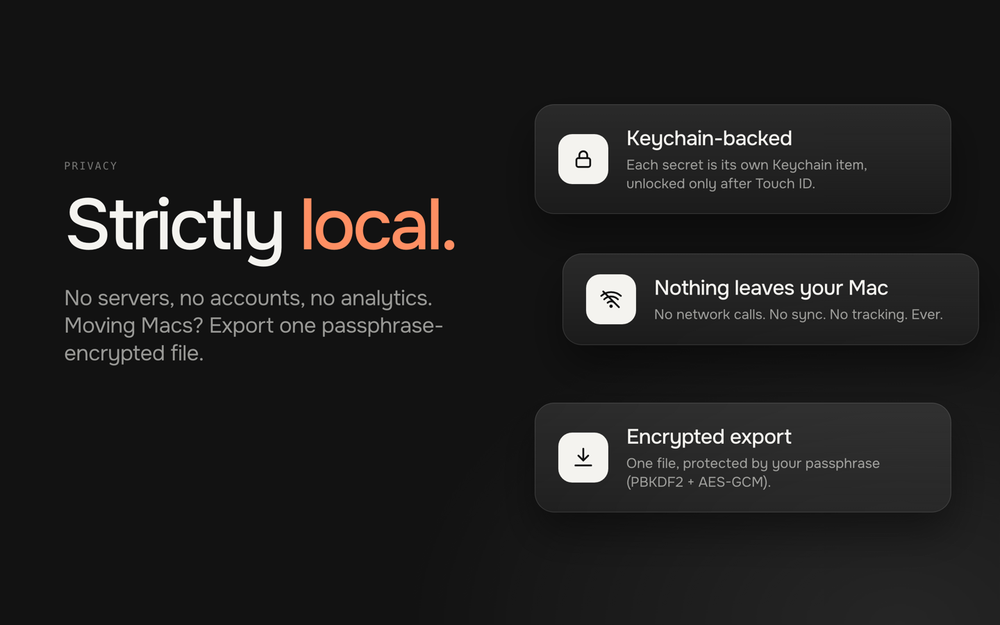
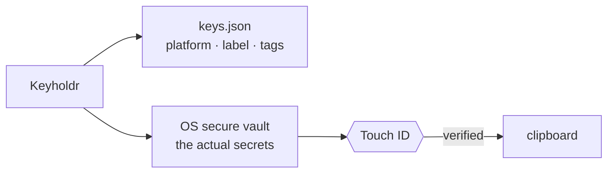

<div align="center">



# Keyholdr

**Your keys, one keystroke away.**

A native macOS menu bar vault for API keys, with a terminal companion.<br>
Keychain-backed storage · Touch ID unlock · No servers, no accounts, no telemetry.

<br>

[**Download on the Mac App Store**](https://apps.apple.com/in/app/keyholdr/id6789253781?mt=12)
&nbsp;·&nbsp; [Homebrew](#option-b--homebrew)
&nbsp;·&nbsp; [Direct download](https://github.com/OlixIgnacious/keyholdr/releases/latest)
&nbsp;·&nbsp; [Website](https://olixignacious.github.io/keyholdr-site/)

[](https://github.com/OlixIgnacious/keyholdr/releases/latest)
[](#install)
[](#build-from-source)
<!-- Windows is hidden until testing on real hardware completes:
[](https://github.com/OlixIgnacious/keyholdr-windows)
-->
[](#license)

<br>



</div>

---

## Contents

[Overview](#overview) ·
[Features](#features) ·
[Install](#install) ·
[Terminal companion](#terminal-companion) ·
[How secrets are stored](#how-secrets-are-stored) ·
[Scratch notes](#scratch-notes) ·
[Build from source](#build-from-source) ·
[Project layout](#project-layout) ·
[Contributing](#contributing) ·
[License](#license)

## Overview

API keys end up in dotfiles, Slack DMs and `notes.txt`. Keyholdr gives them a
proper home: a small native popover next to your clock. Open it, type two
letters, click copy. Touch ID confirms it's you, the secret lands on your
clipboard, and the vault locks itself again.

|  |  |
|---|---|
| **Private by design** | Secrets live in the macOS Keychain, never on disk. There is no server, no sync and no network access. |
| **Fast** | Summon it with `⌃⌥⌘K` from any app, type to filter, and copy. About 700 KB of pure SwiftUI. |
| **Scriptable** | The `keyholdr` CLI reads and injects keys from your terminal, so they never touch your dotfiles. |

## Features

**Vault**

- **Out of sight until needed.** No Dock icon and no window, just a key in the menu bar. Click it, or press `⌃⌥⌘K` from anywhere.
- **Biometric gate.** Every copy and reveal requires Touch ID or Apple Watch.
- **Auto-lock.** Click away and the popover disappears and locks. Nothing lingers.
- **Encrypted export.** Move to a new Mac with one passphrase-protected file (PBKDF2 + AES-GCM).
- **Rotation nudges.** Once a key's secret is more than six months old, a quiet hint shows its age and asks whether to rotate it (for example `11MO · ROTATE?`).
- **Opt-in autostart.** One toggle in the footer starts Keyholdr at login. It is off by default.

**Everything else**

- **Terminal native.** Bare `keyholdr` opens a full-screen UI for your keys and notes. `keyholdr get`, `run` and `env` cover scripts and CI.
- **Scratch notes.** A **Notes** tab beside **Keys** for throwaway text. It autosaves, is plain text, and copies in one click. See [Scratch notes](#scratch-notes).
- **Strictly local.** No analytics, no accounts and no network calls. Ever.
- **Native look.** Liquid Glass on macOS 26 and later, with a flat paper look on older releases.
- **Guided start.** Revisit the first-launch tour any time from the `⋯` menu ("How Keyholdr Works…").

<div align="center">
<table>
  <tr>
    <td width="50%"></td>
    <td width="50%"></td>
  </tr>
  <tr>
    <td width="50%"></td>
    <td width="50%"></td>
  </tr>
</table>
</div>

## Install

Keyholdr needs macOS 13 or later. Pick the channel that suits you:

| Channel | Best for | CLI + full-screen UI |
|---|---|:---:|
| [**Mac App Store**](#option-a--mac-app-store) | Automatic updates, the simplest install | Limited (sandbox) |
| [**Homebrew**](#option-b--homebrew) | Developers who live in the terminal | ✓ |
| [**Direct download**](#option-c--manual-download) | A signed, notarized `.app` with no package manager | ✓ |

### Option A — Mac App Store

[Download Keyholdr](https://apps.apple.com/in/app/keyholdr/id6789253781?mt=12).
Version 1.7.1 is live, with the new app icon and the `⌘N` and `⌃⌥⌘K` fixes for
macOS 27 (see the [changelog](CHANGELOG.md)).

The App Store sandbox limits the bundled command-line tool. For the terminal,
use the Homebrew or direct-download build (see
[Terminal companion](#terminal-companion)).

### Option B — Homebrew

```bash
brew install --cask olixignacious/tap/keyholdr
```

Then open **Keyholdr** from Spotlight or `/Applications`. It is signed and
notarized, so it opens without a Gatekeeper prompt, and Homebrew links the
`keyholdr` CLI onto your PATH.

### Option C — Manual download

1. Grab `Keyholdr-macOS-*.zip` from the [latest release](https://github.com/OlixIgnacious/keyholdr/releases/latest).
2. Unzip and move `Keyholdr.app` to `/Applications`.
3. Open it. No Gatekeeper workaround is needed.

<!-- Windows is hidden until testing on real hardware completes:
| Windows 10/11 (x64) | `Keyholdr-windows-x64-*.zip` | **Still in testing** — built on CI but not yet verified on real hardware. Self-contained single `.exe`, no .NET install needed. SmartScreen: **More info → Run anyway**. |
-->

> A native Windows build (C# 12, WPF) lives in
> [keyholdr-windows](https://github.com/OlixIgnacious/keyholdr-windows). It
> ships once testing on real hardware wraps up.

### Shortcuts (macOS)

| Keys | Action |
|---|---|
| `⌃⌥⌘K` | Summon or dismiss Keyholdr, system-wide |
| `⌘N` | Add a new key (a new note, on the Notes tab) |
| `Esc` | Dismiss the add/edit form, or leave the note editor |
| just type | Search is focused by default |

## Terminal companion

The app bundles a CLI. Homebrew links it onto your PATH automatically. For a
direct download, link it once:

```bash
mkdir -p ~/.local/bin
ln -sf /Applications/Keyholdr.app/Contents/MacOS/keyholdr-cli ~/.local/bin/keyholdr
echo 'export PATH="$HOME/.local/bin:$PATH"' >> ~/.zshrc
```

`/usr/local/bin` isn't user-writable by default on modern macOS, hence
`~/.local/bin`. The in-app **CLI** footer button does the same thing
automatically on a direct-download install.

**Mac App Store build:** the sandbox limits the command-line tool bundled in
that build, so for the terminal, including the full-screen UI, install the
Homebrew or direct-download build instead. **⋯ menu → Terminal Setup…** in the
App Store app shows the Homebrew command.

```bash
keyholdr                                         # full-screen UI: keys + notes, type to filter, ⏎ copies
keyholdr --classic                               # the simple inline picker (⇥/space to mark)
keyholdr list                                    # every key, with age — never the secrets
keyholdr get aws                                 # Touch ID → secret on stdout
keyholdr get github --label work --copy          # to the clipboard instead
keyholdr run -e AWS_ACCESS_KEY_ID=aws -- npm start   # inject as env vars, nothing on stdout
keyholdr run -- npm start                        # multi-select, conventional names guessed
eval "$(keyholdr env)"                           # multi-select, export lines for your shell
eval "$(keyholdr env aws github/work)"           # or name the keys directly
keyholdr env --names                             # dry run: names only, no Touch ID
keyholdr add github --label work --tags dev,ci   # secret via hidden prompt — never argv
pbpaste | keyholdr add aws                       # or piped straight from the clipboard
keyholdr rm github --label work                  # confirms first; --force for scripts
keyholdr rm                                      # multi-select: ⇥/space to mark, ⏎ deletes
```

When several keys match (`keyholdr get aws` with a work and a personal key),
the same picker opens to choose. In scripts and pipes it stays a hard error
with `--label` hints instead, so automation never blocks. The app refuses to
create two keys with an identical platform + label, so every key stays
addressable.

See [docs/CLI.md](docs/CLI.md) for the full command reference, including
`env`/`run` multi-select and env var naming conventions.

The first read of each key shows a one-time macOS Keychain consent. Choose
**Always Allow** and it won't ask again.

## How secrets are stored

Metadata and secrets never travel together:


```mermaid
graph LR
    UI[Keyholdr] --> M["keys.json<br>platform · label · tags"]
    UI --> V["OS secure vault<br>the actual secrets"]
    V --> B{{"Touch ID"}}
    B -->|verified| C[clipboard]
```

| | |
|---|---|
| **Metadata** | `~/Library/Application Support/com.olixstudios.Keyholdr/keys.json` |
| **Secrets** | Keychain Services (`Security` API) |
| **Unlock** | Touch ID / Apple Watch (`LocalAuthentication`) |

`keys.json` holds platform names, labels, and tags only. The secret is fetched
from the OS vault at the moment you copy it, and only after biometric
authentication succeeds.

**Self-healing on macOS:** every save also mirrors the (non-secret) metadata
into a Keychain item. If `keys.json` is ever deleted or corrupted, the app
silently restores it from the mirror. Since secrets already live in the
Keychain, deleting the app or its files loses nothing. *(Windows parity is on
the roadmap.)*

See [SECURITY.md](SECURITY.md) to report a vulnerability privately.

## Scratch notes

A **KEYS | NOTES** switcher at the top of the popover flips between the vault
and a scrap pad for the text you'd otherwise open Notes.app for: a command to
re-run, a link to paste later, a half-formed thought.

- **Fast.** `⌘N` on the Notes tab starts a new note. Type or paste, and it
  autosaves as you go, even when the popover closes mid-sentence. No save
  button, no Touch ID.
- **Searchable.** Filter the list by title or body. One click on `COPY` puts
  the whole note on the clipboard.
- **Tidy.** Empty notes discard themselves: back out of a blank note and it's gone.

> [!WARNING]
> **Notes are plain text and are not encrypted.** Unlike keys, they live in a
> regular file and are *not* protected by the Keychain or Touch ID, so keep
> secrets in **Keys**. Notes are also not included in vault export/import.

| | |
|---|---|
| **Storage** | `~/Library/Application Support/com.olixstudios.Keyholdr/notes.json` |
| **Encryption** | None: plain JSON, readable by any process running as you |
| **Vault export** | Not included |

## Build from source

### macOS

1. Install full [Xcode](https://developer.apple.com/xcode/), select it
   (`sudo xcode-select -s /Applications/Xcode.app`) and accept its licence.
   The Command Line Tools alone can't build the app on the current macOS SDK.
2. Run `./build.sh`: release build → signed app bundle → launches in your
   menu bar. Add `--no-launch` to build without touching running processes.
3. Optional: `swift test` runs the test suite. For the Mac App Store variant,
   see `build-mas.sh`.

### Windows

The Windows app lives in its own repo,
[keyholdr-windows](https://github.com/OlixIgnacious/keyholdr-windows)
*(source only while testing is pending)*.

1. Install the [.NET 8 SDK](https://dotnet.microsoft.com/en-us/download/dotnet/8.0).
2. `cd Keyholdr`
3. `dotnet run` for development, or `dotnet publish -c Release` for a self-contained single-file exe.

Tagged releases (`v*`) automatically build the macOS app on CI and attach it
to the GitHub release. The Windows build is manual-dispatch only until it is
verified on real hardware.

## Project layout

```text
keyholdr/
├── Sources/KeyholdrKit/     shared core — model, Keychain, storage, vault export, notes
├── Sources/keyholdr/        macOS app — Swift 6, SwiftUI
│   ├── KeyholdrApp.swift      MenuBarExtra entry point
│   ├── Models/                 login item, global hotkey
│   └── Views/                  popover UI, monochrome theme
├── Sources/KeyholdrTUI/     terminal UI primitives — raw mode, key parsing, text editing
├── Sources/keyholdr-cli/    terminal companion — full-screen UI, list, get, run
├── Tests/keyholdrTests/     Swift Testing suites for Kit and TUI
├── scripts/                  Xcode-free test harness, terminal UI smoke test
├── docs/                     CLI reference and README media
├── branding/                 app icon and App Store asset generators
├── build.sh                  macOS build + bundle script (direct distribution)
└── build-mas.sh               Mac App Store build + signed installer .pkg
```

The Windows app (C# 12, WPF, .NET 8) and the marketing site each live in
their own repo:
[keyholdr-windows](https://github.com/OlixIgnacious/keyholdr-windows) ·
[keyholdr-site](https://github.com/OlixIgnacious/keyholdr-site).

## Contributing

Issues and pull requests are welcome. Bug reports, platform/icon mappings,
and CLI ergonomics are especially useful. By opening a PR you agree your
contribution is provided under the same non-commercial license as the rest
of the project. See [CONTRIBUTING.md](CONTRIBUTING.md) for setup, tests, and
PR guidelines.

Found a security issue? See [SECURITY.md](SECURITY.md) for how to report it
privately. See [CHANGELOG.md](CHANGELOG.md) for release history.

## License

Non-commercial use only. Free to copy, fork, and modify for personal or
educational use, not for resale or commercial services. All copyright
remains with Ashwini Sharma (Olix Studios). See [LICENSE](LICENSE).

<div align="center">
<br>
<br>
<sub>Keyholdr · Built for developers who copy API keys forty times a day.<br>
© Ashwini Sharma (Olix Studios)</sub>
</div>
