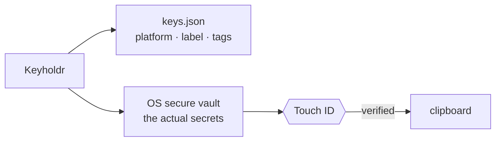

<div align="center">

# Keyholdr

**Your keys, one keystroke away.**

A native menu bar vault for API keys.<br>
Hardware-backed storage. Biometric unlock. Zero Electron.

[**Website**](https://olixignacious.github.io/keyholdr-site/) · [**Mac App Store**](https://apps.apple.com/in/app/keyholdr/id6789253781?mt=12) · [**Direct download**](https://github.com/OlixIgnacious/keyholdr/releases/latest) · [**Build from source**](#build-from-source)

[](https://github.com/OlixIgnacious/keyholdr/releases/latest)
[](https://github.com/OlixIgnacious/keyholdr/releases/latest)
<!-- Windows is hidden until testing on real hardware completes:
[](https://github.com/OlixIgnacious/keyholdr-windows)
-->
[](#license)

<br>


</div>

---

## Contents

- [Features](#features)
- [How secrets are stored](#how-secrets-are-stored)
- [Scratch notes](#scratch-notes)
- [Install](#install)
- [Terminal companion](#terminal-companion)
- [Build from source](#build-from-source)
- [Project layout](#project-layout)
- [Contributing](#contributing)
- [License](#license)

## Features

API keys end up in dotfiles, Slack DMs, and `notes.txt`. Keyholdr gives them a
proper home: a tiny native popover next to your clock. Open it, type two
letters, hit copy — Touch ID verifies it's you, the secret lands on your
clipboard, and everything locks itself again.

- **Out of sight, never out of reach** — no dock icon, no window. A key icon in the menu bar, summoned with a click or `⌃⌥⌘K` from anywhere.
- **Survives reboots** — one-click AUTOSTART toggle to start at login, opt-in.
- **Hardware-backed, nothing in cleartext** — secrets live in the macOS Keychain, never on disk.
- **Biometric gate** — every copy and reveal requires Touch ID or Apple Watch.
- **Auto-lock** — click away and the popover vanishes and locks. Nothing lingers.
- **Featherweight** — pure SwiftUI. **~700 KB**.
- **Strictly local** — no servers, no sync, no analytics, no network calls. Ever.
- **Moves when you do** — export the vault to a single passphrase-encrypted file (PBKDF2 + AES-GCM) and import it on the new machine.
- **Terminal native** — plain `keyholdr` opens a full-screen UI for your keys and notes; `keyholdr get aws` prints a secret after Touch ID; `keyholdr run` injects keys as env vars so they never touch your dotfiles.
- **Rotation nudges** — a quiet `11MO · ROTATE?` hint appears on keys whose secret hasn't changed in six months.
- **Onboarding, on demand** — revisit the first-launch tour any time from the `⋯` menu ("How Keyholdr Works…"), which also links out to the website.
- **Scratch notes** — a **Notes** tab next to **Keys** for jotting or pasting throwaway text without opening Notes.app. Autosaves, plain text, one click to copy. See [Scratch notes](#scratch-notes).
- **Liquid Glass on macOS 26** — the switcher, search fields and buttons use the system glass material on macOS 26 and later, and the flat paper look on older releases.

## How secrets are stored

Metadata and secrets never travel together:


```mermaid
graph LR
    UI[Keyholdr] --> M["keys.json<br>platform · label · tags"]
    UI --> V["OS secure vault<br>the actual secrets"]
    V --> B{{"Touch ID"}}
    B -->|verified| C[clipboard]
```

| | |
|---|---|
| **Metadata** | `~/Library/Application Support/com.olixstudios.Keyholdr/keys.json` |
| **Secrets** | Keychain Services (`Security` API) |
| **Unlock** | Touch ID / Apple Watch (`LocalAuthentication`) |

`keys.json` holds platform names, labels, and tags only. The secret is fetched
from the OS vault at the millisecond you copy it — and only after biometric
authentication succeeds.

**Self-healing on macOS:** every save also mirrors the (non-secret) metadata
into a Keychain item. If `keys.json` is ever deleted or corrupted, the app
silently restores it from the mirror — and since secrets already live in the
Keychain, deleting the app or its files loses nothing. *(Windows parity is on
the roadmap.)*

## Scratch notes

A **KEYS | NOTES** switcher at the top of the popover flips between the vault
and a scrap pad for the text you'd otherwise open Notes.app for: a command to
re-run, a link to paste later, a half-formed thought.

- **Fast** — `⌘N` on the Notes tab starts a new note; type or paste, and it
  autosaves as you go (also when the popover closes mid-sentence). No save
  button, no Touch ID.
- **Searchable** — filter the list by title or body; one click on `COPY`
  puts the whole note on the clipboard.
- **Empty notes discard themselves** — back out of a blank note and it's gone.

**Notes are plain text and are not encrypted.** Unlike keys, they live in a
regular file and are *not* protected by the Keychain or Touch ID, so keep
secrets in **Keys**. Notes are also not included in vault export/import.

| | |
|---|---|
| **Storage** | `~/Library/Application Support/com.olixstudios.Keyholdr/notes.json` |
| **Encryption** | None — plain JSON, readable by any process running as you |
| **Vault export** | Not included |

## Install

### Option A — Mac App Store

[Download Keyholdr](https://apps.apple.com/in/app/keyholdr/id6789253781?mt=12).
Sandboxed, which limits its command-line tool — for the terminal, use the
Homebrew or direct-download build below (see
[Terminal companion](#terminal-companion)).

### Option B — Homebrew

1. `brew install --cask olixignacious/tap/keyholdr`
2. Open **Keyholdr** from Spotlight or `/Applications` — it's signed and notarized, so it opens without any Gatekeeper prompt.

### Option C — Manual download

1. Grab `Keyholdr-macOS-*.zip` from the [latest release](https://github.com/OlixIgnacious/keyholdr/releases/latest).
2. Unzip and move `Keyholdr.app` to `/Applications`.
3. Open it — no Gatekeeper workaround needed.

<!-- Windows is hidden until testing on real hardware completes:
| Windows 10/11 (x64) | `Keyholdr-windows-x64-*.zip` | **Still in testing** — built on CI but not yet verified on real hardware. Self-contained single `.exe`, no .NET install needed. SmartScreen: **More info → Run anyway**. |
-->

> A native Windows build (C# 12, WPF) lives in
> [keyholdr-windows](https://github.com/OlixIgnacious/keyholdr-windows) — it
> ships once testing on real hardware wraps up.

### Shortcuts (macOS)

| Keys | Action |
|---|---|
| `⌃⌥⌘K` | Summon or dismiss Keyholdr — works system-wide |
| `⌘N` | Add a new key (a new note, on the Notes tab) |
| `Esc` | Dismiss the add/edit form (or leave the note editor) |
| just type | Search is focused by default |

## Terminal companion

The app bundles a CLI. Homebrew links it onto your PATH automatically; for a
direct download, link it once:

```bash
mkdir -p ~/.local/bin
ln -sf /Applications/Keyholdr.app/Contents/MacOS/keyholdr-cli ~/.local/bin/keyholdr
echo 'export PATH="$HOME/.local/bin:$PATH"' >> ~/.zshrc
```

(`/usr/local/bin` isn't user-writable by default on modern macOS, hence
`~/.local/bin` — the in-app **CLI** footer button does this same thing
automatically on a direct-download install.)

**Mac App Store build:** the sandbox limits the command-line tool bundled in
that build, so for the terminal — including the full-screen UI — install the
Homebrew or direct-download build instead. **⋯ menu → Terminal Setup…** in the
App Store app shows the Homebrew command.

```bash
keyholdr                                         # full-screen UI: keys + notes, type to filter, ⏎ copies
keyholdr --classic                               # the simple inline picker (⇥/space to mark)
keyholdr list                                    # every key, with age — never the secrets
keyholdr get aws                                 # Touch ID → secret on stdout
keyholdr get github --label work --copy          # to the clipboard instead
keyholdr run -e AWS_ACCESS_KEY_ID=aws -- npm start   # inject as env vars, nothing on stdout
keyholdr run -- npm start                        # multi-select, conventional names guessed
eval "$(keyholdr env)"                           # multi-select, export lines for your shell
eval "$(keyholdr env aws github/work)"           # or name the keys directly
keyholdr env --names                             # dry run: names only, no Touch ID
keyholdr add github --label work --tags dev,ci   # secret via hidden prompt — never argv
pbpaste | keyholdr add aws                       # or piped straight from the clipboard
keyholdr rm github --label work                  # confirms first; --force for scripts
keyholdr rm                                      # multi-select: ⇥/space to mark, ⏎ deletes
```

When several keys match (`keyholdr get aws` with a work and a personal key),
the same picker opens to choose — in scripts and pipes it stays a hard error
with `--label` hints instead, so automation never blocks. The app refuses to
create two keys with an identical platform + label, so every key stays
addressable.

See [docs/CLI.md](docs/CLI.md) for the full command reference, including
`env`/`run` multi-select and env var naming conventions.

The first read of each key shows a one-time macOS Keychain consent — choose
**Always Allow** and it won't ask again.

## Build from source

### macOS

1. Install full [Xcode](https://developer.apple.com/xcode/), select it
   (`sudo xcode-select -s /Applications/Xcode.app`) and accept its licence.
   The Command Line Tools alone can't build the app on the current macOS SDK.
2. Run `./build.sh` — release build → signed app bundle → launches in your
   menu bar. Add `--no-launch` to build without touching running processes.
3. Optional: `swift test` runs the test suite. For the Mac App Store variant,
   see `build-mas.sh`.

### Windows

The Windows app lives in its own repo,
[keyholdr-windows](https://github.com/OlixIgnacious/keyholdr-windows)
*(source only while testing is pending)*.

1. Install the [.NET 8 SDK](https://dotnet.microsoft.com/en-us/download/dotnet/8.0).
2. `cd Keyholdr`
3. `dotnet run` for development, or `dotnet publish -c Release` for a self-contained single-file exe.

Tagged releases (`v*`) automatically build the macOS app on CI and attach it
to the GitHub release. The Windows build is manual-dispatch only until it is
verified on real hardware.

## Project layout

```text
keyholdr/
├── Sources/KeyholdrKit/     shared core — model, Keychain, storage, vault export, notes
├── Sources/keyholdr/        macOS app — Swift 6, SwiftUI
│   ├── KeyholdrApp.swift      MenuBarExtra entry point
│   ├── Models/                 login item, global hotkey
│   └── Views/                  popover UI, monochrome theme
├── Sources/KeyholdrTUI/     terminal UI primitives — raw mode, key parsing, text editing
├── Sources/keyholdr-cli/    terminal companion — full-screen UI, list, get, run
├── Tests/keyholdrTests/     Swift Testing suites for Kit and TUI
├── scripts/                  Xcode-free test harness, terminal UI smoke test
├── docs/                     CLI reference and README media
├── branding/                 app icon and App Store asset generators
├── build.sh                  macOS build + bundle script (direct distribution)
└── build-mas.sh               Mac App Store build + signed installer .pkg
```

The Windows app (C# 12, WPF, .NET 8) and the marketing site each live in
their own repo:
[keyholdr-windows](https://github.com/OlixIgnacious/keyholdr-windows) ·
[keyholdr-site](https://github.com/OlixIgnacious/keyholdr-site).

## Contributing

Issues and pull requests are welcome — bug reports, platform/icon mappings,
and CLI ergonomics are especially useful. By opening a PR you agree your
contribution is provided under the same non-commercial license as the rest
of the project. See [CONTRIBUTING.md](CONTRIBUTING.md) for setup, tests, and
PR guidelines.

Found a security issue? See [SECURITY.md](SECURITY.md) for how to report it
privately. See [CHANGELOG.md](CHANGELOG.md) for release history.

## License

Non-commercial use only. Free to copy, fork, and modify for personal or
educational use — not for resale or commercial services. All copyright
remains with Ashwini Sharma (Olix Studios). See [LICENSE](LICENSE).

<div align="center">
<sub>Built for developers who copy API keys forty times a day.</sub>
</div>
